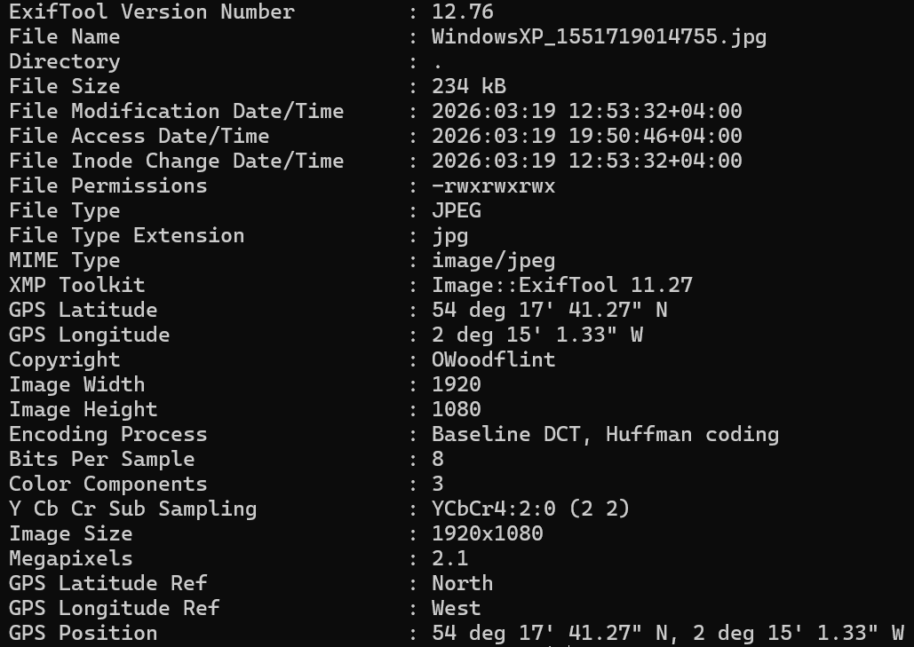
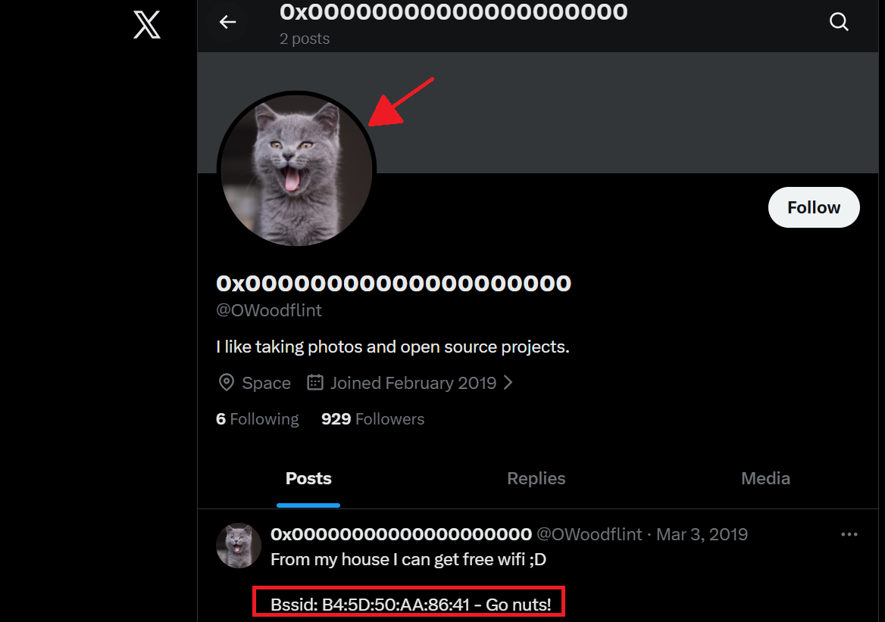
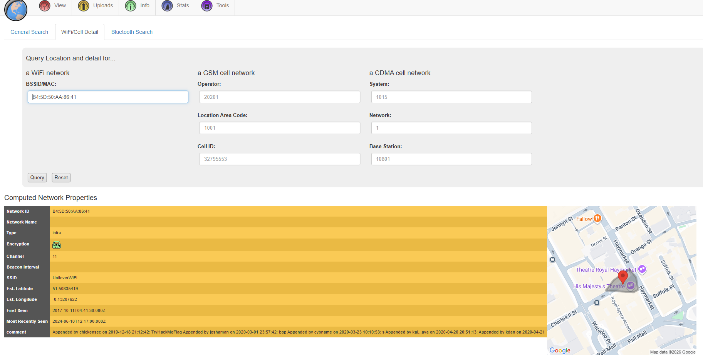
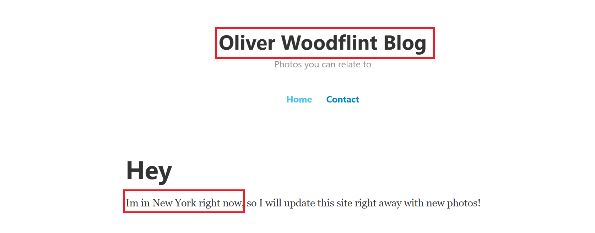
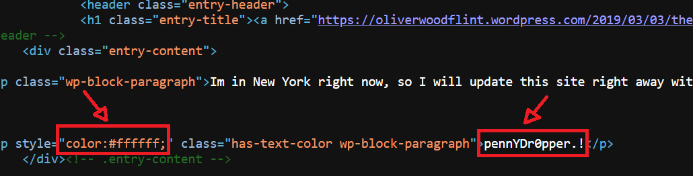

# OhSINT Write-up 

## 🧠 Overview

This room is an introduction to Open Source Intelligence (OSINT), where the goal is to gather information using publicly available sources.
In this challenge, I was given an image and had to analyze it to find clues about a person. By following these clues and searching online, I was able to uncover information such as usernames, social media accounts, and eventually the password.
This room helped me understand how small pieces of information can be connected to build a bigger picture.

## 🔍 Step 1 - Image Analysis

I started by downloading the image provided in the challenge and analyzing it, since images often contain hidden information in their metadata.

To extract this information, I used the tool `exiftool`, which allows you to view metadata stored inside files.

Command used: exiftool WindowsXP_1551719014755.jpg

## 🔎 Step 2 - Username Investigation

From the metadata, I noticed a copyright name: **OWoodflint**, which looked like a possible username.
I started by searching it on Google to see if anything would come up. Very quickly, I found both an X (Twitter) account and a GitHub profile with the same name.

I opened the X account first, and it immediately helped me answer the first question of the challenge: the user’s avatar is a cat.
While exploring the profile, I also found another useful piece of information. The user mentioned having free WiFi and shared a BSSID.

I used a website like **wigle.net** to search for this BSSID. By doing an advanced search, I was able to find its location in London, and also discovered that the SSID was **UnileverWiFi**.

With this, I was able to answer two questions and move on to the next one: finding the user’s email address.

## 🔐 Step 3 - Finding the Email and Password

I went back to my search and opened the GitHub profile I had found earlier. It contained more useful information.
From there, I was able to confirm that the user is from London. Even though I already had an idea from the BSSID lookup.
The GitHub profile also revealed an email address, which allowed me to answer another question. In addition, there was a link to a WordPress blog.

After opening the blog, I discovered the full name of the user: **Oliver Woodflint**. The page also mentioned that he was currently in New York, which answered the question about where he had gone on holiday.

At this point, the only remaining question was the password.
To find the password, I decided to inspect the source code of the website.

At first, I tried a quick approach by using `Ctrl + F` to search for common keywords such as "password", "login", "admin", and similar terms that might reveal something useful. However, this didn’t return any results.

Since that didn’t work, I then started going through the source code manually, carefully checking different sections.

After going back and forward through the code for a while, I finally noticed something unusual, a line of text with a color style set to `#ffffff`, which is white. Because the website background is also white, this made the text invisible on the page.

Looking closer, I realized that this hidden text was actually the password, cleverly disguised using CSS.

## ✅ Conclusion

This room was a really good introduction to OSINT and how information can be gathered from different public sources.

While working through the challenge, I realized how small details like metadata or a username can lead to much bigger findings when combined together.

As this is my first write-ups, it also helped me understand the importance of taking a structured approach and paying attention to every detail, even when something doesn’t seem useful at first.

Overall, this challenge showed me how powerful simple techniques can be, and how important it is to stay patient and curious during an investigation.
